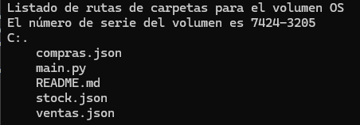

# Farmacia

Sistema integral de gestión de la administración de medicamentos, proveedores, empleados, pacientes, así como la generación de informes relevantes.

# Índice

1. [Estado del proyecto](#id1)
2. [Descripción del Proyecto](#id2)
3. [Tecnologías Utilizadas](#id3)
4. [Estructura del proyecto](#id4)
5. [Características](#id5)
6. [Diseño](#id6)
7. [Instrucciones](#id7)
8. [Personas Desarrolladoras del Proyecto](#id8)

# Estado del Proyecto

Finalizado

# Descripción del Proyecto

1. **Gestión de Ventas y Compras:**

    - **Ventas:** El sistema permite registrar cada transacción de venta con la siguiente información:
        - Fecha de la venta.
        - Información del paciente (nombre, dirección).
        - Información del empleado que realizó la venta (nombre, cargo).
        - Medicamentos vendidos (nombre, cantidad, precio).
        
    - **Compras:** El sistema permite registrar cada compra realizada a los proveedores con la siguiente información:
        - Fecha de la compra.
        - Información del proveedor (nombre, contacto).
        - Medicamentos comprados (nombre, cantidad, precio de compra).

Este sistema de gestión integral proporcionará a la farmacia las herramientas necesarias para mejorar la eficiencia operativa, mantener la trazabilidad de todas las transacciones, y asegurar la satisfacción de los pacientes mediante una gestión adecuada de los medicamentos y servicios ofrecidos.

# Tecnologías utilizadas

* Python

# Estructura del Proyecto

# Características

Archivos Fundamentales:

**main.py**: Este archivo es el corazón del sistema. Contiene el código que maneja la parte lógica del programa, es fundamental para que funcione el sistema.

**compras.json**: Aquí se guarda la información de las compras realizadas a los proveedores.

**ventas.json**: Aquí se guarda la información de cada venta realizada.

**stock.json**: Aquí se guarda la información de cada producto del inventario (nombre, precio, cantidad). 

# Diseño

* Solo puede ser visto y usado en consola

# Instrucciones

1. Clonar el repositorio
~~~
https://github.com/JesusBustamante/Filtro_python_BustamanteJesus.git
~~~

2. Si es clonado en Visual Studio Code, descargue la extensión de Python.

3. También descargue python desde un navegador web o la microsoft store.

3. Ejecuta el programa en la terminal de GitBash de la siguiente forma: 
~~~ 
python main.py 
~~~

# Personas Desarrolladoras del Proyecto

Este proyecto fue desarrollado por Jesús Leonardo Bustamante Ramírez, estudiante de Campuslands, como trabajo requerido para el módulo de Git.